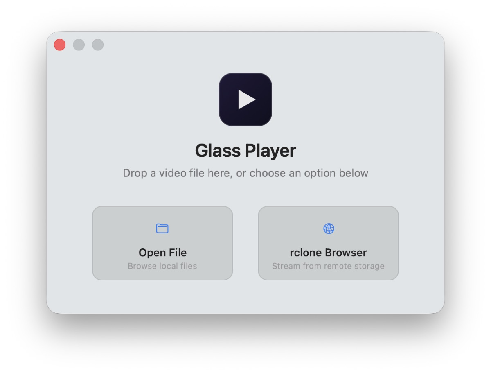
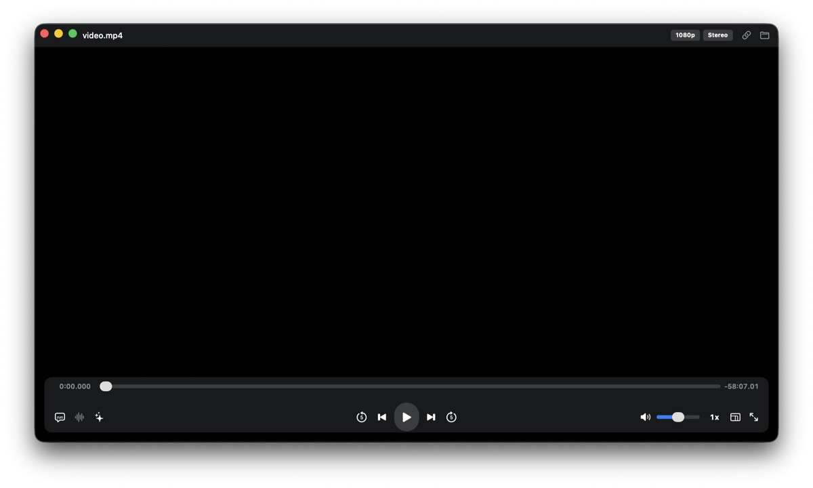
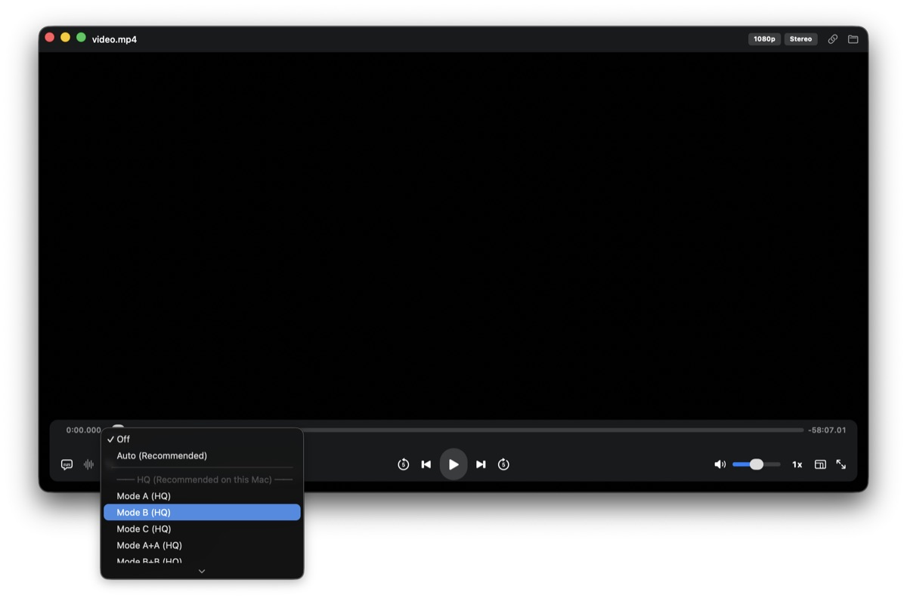

# Glass Player

A lightweight, native macOS video player built on Metal 3 and libmpv. Designed exclusively for Apple Silicon (M-series), featuring zero-copy rendering, Anime4K upscaling, and advanced HDR/Audio support.


---

## Key Features

- **Rendering:** Native Metal 3 pipeline with IOSurface zero-copy bridging.
- **HDR & Audio:** Dolby Vision, HDR10/HLG tone mapping, and Atmos/TrueHD bitstream passthrough.
- **Playback:** Format badges, built-in rclone cloud streaming, and Picture-in-Picture.
- **Integration:** macOS Now Playing support, Spatial Audio, and real-time settings.

---

## Requirements

| Component | Specification |
|---|---|
| OS | macOS 14.0 Sonoma or later |
| Hardware | Apple Silicon (M-series) |
| Dependencies | Homebrew (for source builds) |

---

## Screenshots

<p align="center">
  
</p>
<p align="center">
  
</p>
<p align="center">
  
</p>

---

## Installation

### From Releases (Recommended)
1. Download the `.dmg` from the Releases page.
2. Open the disk image and execute the "Install Glass Player" script.
*(Alternatively: Drag to Applications and run `xattr -cr "/Applications/Glass Player.app"` in Terminal to clear Gatekeeper).*

### Build from Source
```bash
brew install mpv
git clone [https://github.com/khr898/Glass_player.git](https://github.com/khr898/Glass_player.git)
cd Glass_player/GlassPlayer
bash build.sh
```
*Build Options:* `BUILD_PROFILE=baseline`, `NO_INSTALL=1`, `SKIP_SIGN=1`.

---

## Usage

Launch via Spotlight or Terminal:
```bash
open "/Applications/Glass Player.app" --args /path/to/video.mkv
```

**Shortcuts:**
- **Space:** Play / Pause
- **Arrows (←/→, ↑/↓):** Seek / Volume
- **F / M:** Fullscreen / Mute
- **[ / ]:** Speed Down / Up
- **⌘O / ⌘,:** Open File / Settings

---

## Architecture
```text
[mpv GPU renderer] --(shared UMA)--> [Metal 3 Pipeline] --> [Screen]
```
Leverages Apple Silicon's Unified Memory Architecture (UMA). Frames are rendered to an IOSurface-backed FBO, allowing the Metal texture to access the exact same physical memory block, completely eliminating GPU-to-GPU memory copies.

---

## Anime4K Shaders
Enable the bundled Anime4K upscaling shaders via **Settings → Shaders**.

Check out the Anime4K Github repo for more information.
---

## Releases
Release compilation is automated via GitHub Actions. To initiate a release workflow:
```bash
git tag v1.0.0
git push origin v1.0.0
```

---

## License & Acknowledgments
- **License:** GPL-3.0 (due to FFmpeg/mpv dependencies). Anime4K shaders are licensed under MIT.
- **Powered by:** mpv, FFmpeg, and Anime4K.